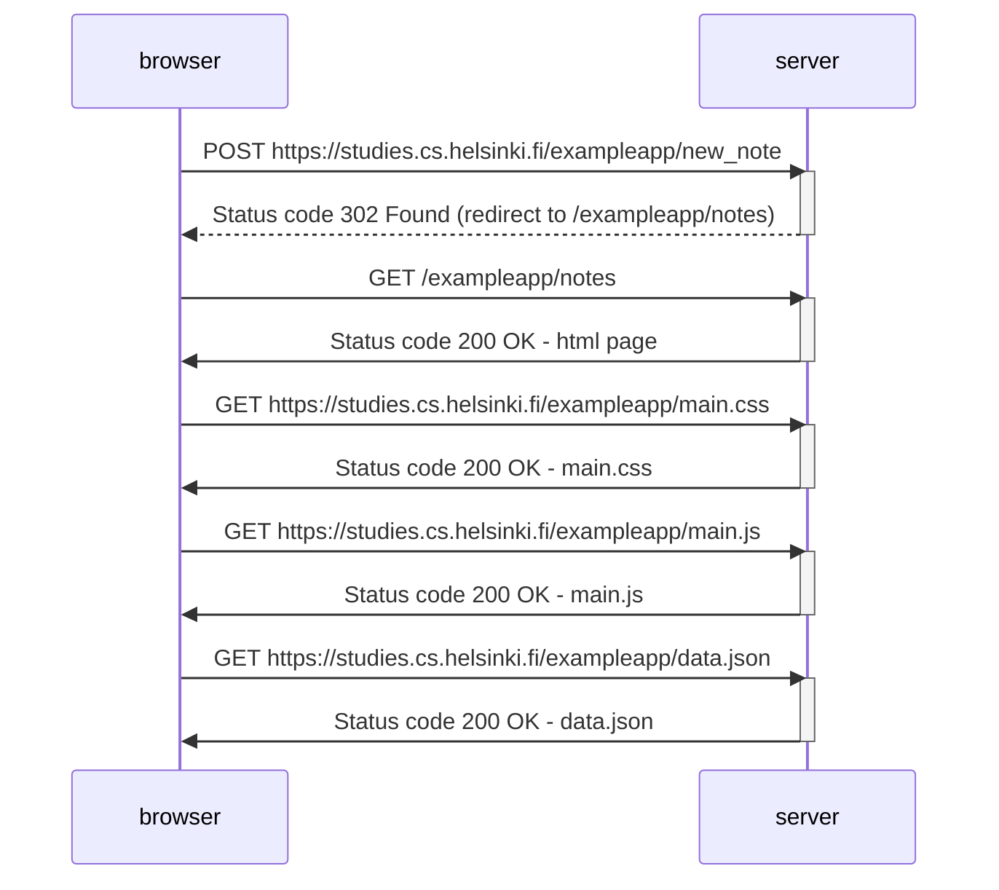

```mermaid
sequenceDiagram
    participant browser
    participant server
    browser->>server: POST https://studies.cs.helsinki.fi/exampleapp/new_note
    activate server
    server-->>browser: Status code 302 Found (redirect to /exampleapp/notes)
    deactivate server
    browser->>server: GET /exampleapp/notes
    activate server
    server->>browser: Status code 200 OK - html page
    deactivate server
    browser->>server: GET https://studies.cs.helsinki.fi/exampleapp/main.css
    activate server
    server->>browser: Status code 200 OK - main.css
    deactivate server
    browser->>server: GET https://studies.cs.helsinki.fi/exampleapp/main.js
    activate server
    server->>browser: Status code 200 OK - main.js
    deactivate server
    browser->>server: GET https://studies.cs.helsinki.fi/exampleapp/data.json
    activate server
    server->>browser: Status code 200 OK - data.json
    deactivate server
```